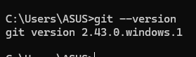
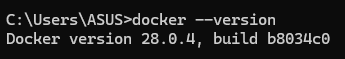
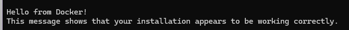
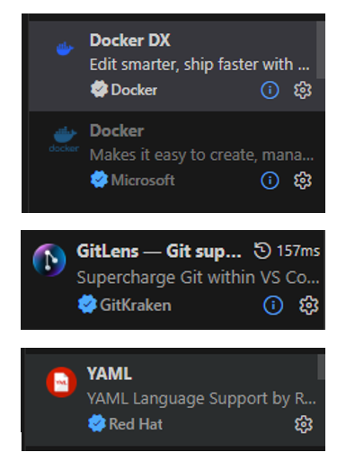

# 📋 Laporan Praktikum Pertemuan 01
## DevOps Culture & Principles

---

## 👤 Identitas Mahasiswa

| Item | Keterangan |
|------|------------|
| **Nama** | ASHABUL KAHFI |
| **NIM** | 105841108523 |
| **Kelas** | 5C |
| **Tanggal** | 2026-02-24 |

---

## 📚 Pemahaman DevOps

### Apa itu DevOps?

DevOps adalah sebuah pendekatan, kultur, dan serangkaian praktik yang menggabungkan pengembangan perangkat lunak (Development) dan operasional teknologi informasi (Operations). Secara tradisional, kedua tim ini sering kali bekerja secara terpisah atau dalam "silo". Tim Dev fokus pada menciptakan fitur baru secepat mungkin, sementara tim Ops berfokus pada menjaga stabilitas dan keandalan sistem. Perbedaan prioritas ini sering menimbulkan konflik dan memperlambat proses rilis aplikasi.

Kehadiran DevOps bertujuan untuk meruntuhkan batasan tersebut dengan menciptakan budaya kolaborasi dan komunikasi yang erat. Tujuan utama dari DevOps adalah untuk memperpendek siklus hidup pengembangan sistem dan memberikan pengiriman fitur, perbaikan bug, serta pembaruan secara terus-menerus (continuous delivery) dengan kualitas yang tinggi.

Dengan mengadopsi DevOps, proses yang sebelumnya manual dan memakan waktu—seperti pengujian dan deployment—dapat diotomatisasi. Manfaatnya sangat luas, mulai dari peningkatan kecepatan rilis produk, penyelesaian masalah yang lebih cepat, hingga peningkatan keamanan. Singkatnya, DevOps bukan sekadar tools, melainkan perubahan mindset fundamental tentang bagaimana produk IT dibangun, diuji, dan didistribusikan.

### Mengapa DevOps Penting?

DevOps sangat penting karena tuntutan pasar saat ini mengharuskan perusahaan untuk beradaptasi dan merilis inovasi dengan sangat cepat namun tetap stabil. Tanpa DevOps, proses rilis bisa memakan waktu berminggu-minggu dan rentan terhadap human error.
Contoh konkret: Sebuah startup e-commerce menghadapi traffic tinggi saat hari diskon nasional (Harbolnas). Dengan praktik CI/CD dari DevOps, jika terjadi bug pada sistem pembayaran, developer dapat memperbaiki kode, mengujinya secara otomatis, dan melakukan deployment perbaikan ke server produksi hanya dalam hitungan menit tanpa mengganggu pengguna yang sedang berbelanja.

### Contoh Perusahaan yang Menerapkan DevOps

Netflix, Amazon, Tokopedia, dan Gojek.

---

## 🎯 Pemahaman Prinsip CALMS

C - Culture (Budaya): Membangun rasa tanggung jawab bersama antara Dev dan Ops. Contoh: Melakukan blameless post-mortem (evaluasi tanpa saling menyalahkan) ketika terjadi server down untuk fokus mencari solusi sistematis.

A - Automation (Otomatisasi): Mengurangi pekerjaan manual yang berulang. Contoh: Menggunakan alat seperti GitHub Actions atau Jenkins untuk otomatis menjalankan testing setiap kali ada programmer yang melakukan commit kode baru.

L - Lean (Ramping): Menghilangkan proses yang tidak memberikan nilai tambah (waste). Contoh: Mengurangi lapisan birokrasi approval berlapis untuk rilis fitur kecil yang sudah lulus automated testing.

M - Measurement (Pengukuran): Memantau semua aspek performa sistem. Contoh: Menggunakan Prometheus atau Grafana untuk memonitor metrik penggunaan CPU, RAM, dan tingkat error pada aplikasi secara real-time.

S - Sharing (Berbagi): Berbagi pengetahuan, tools, dan ide. Contoh: Membuat dokumentasi Wiki/Confluence yang terpusat sehingga teknisi baru bisa langsung memahami arsitektur sistem tanpa harus bertanya berulang-ulang.


---

## 🔧 Setup Development Environment

### Versi Software

| Software | Versi |
|----------|-------|
| Git | git version 2.43.0 |
| Docker | Docker version 28.0.4 |

### Konfigurasi Git

```
user.name = kahfi
user.email = 105841108523@student.unismuh.ac.id
```

### VS Code Extensions

1.Docker
2.GitLens
3.YAML
4.Live Preview

### GitHub Account

- Username: Kahfi10

---

## 📸 Screenshots

| No | Screenshot | Keterangan |
|----|------------|------------|
| 1 |  | Output git --version |
| 2 |  | Output git config --list |
| 3 |  | Output docker --version |
| 4 |  | Output docker run hello-world |
| 5 |  | VS Code dengan extensions |

---

## 💭 Refleksi Pribadi

### Harapan dari Praktikum Ini

Harapan saya adalah mendapatkan pemahaman praktis mengenai bagaimana siklus pengembangan perangkat lunak di industri modern berjalan, serta terbiasa menggunakan tools standar industri.

### Skill yang Ingin Dikuasai

Saya ingin menguasai otomatisasi CI/CD pipelines, mahir menggunakan Git untuk kolaborasi tingkat lanjut (branching strategies), serta memahami dasar-dasar containerization menggunakan Docker.

### Tantangan yang Dihadapi

Tantangan terbesarnya adalah memahami dan membedakan alur kerja sistem version control (seperti fork, syncing commit), serta memastikan seluruh environment lokal seperti Docker berjalan tanpa error di tahap awal setup.

---

## ✅ Checklist

- [x] Git terinstall dan terkonfigurasi dengan benar
- [x] Docker dapat menjalankan container hello-world
- [x] VS Code terinstall dengan semua extensions yang diminta
- [x] Laporan ditulis dengan bahasa yang baik dan benar
- [x] Semua screenshot jelas dan terbaca

---

*Laporan ini dibuat pada Selasa, 24 Februari 2026*
